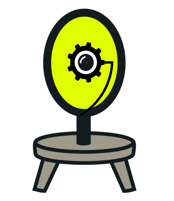
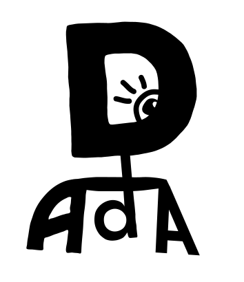

# dada-artwork

Dada logo and other artwork:

## Main logo and mascot: meet Tzara

<a href="https://raw.githubusercontent.com/dada-lang/dada-artwork/main/dada.svg"></img></a>

As with rust-lang's [Ferris](https://rustacean.net/), Tzara's pronouns are "any": he/she/they/xir/it, it's all good. Tzara just likes to be talked about.

## Tzara likes to wear green

<a href="https://raw.githubusercontent.com/dada-lang/dada-artwork/main/dada-acid-green.svg"></img></a>

Sometimes Tzara likes to wear Green.

## Alternate logo: Funky words

<a href="https://raw.githubusercontent.com/dada-lang/dada-artwork/main/dada-acid-green.svg"></img></a>

This alternate logo is appropriate if you want to look fancy. That's Tzara blinking out from the corner there (without their monocle).

## Licensing

Tzara is licensed under [CC0](https://github.com/dada-lang/dada-artwork/blob/main/LICENSE).

